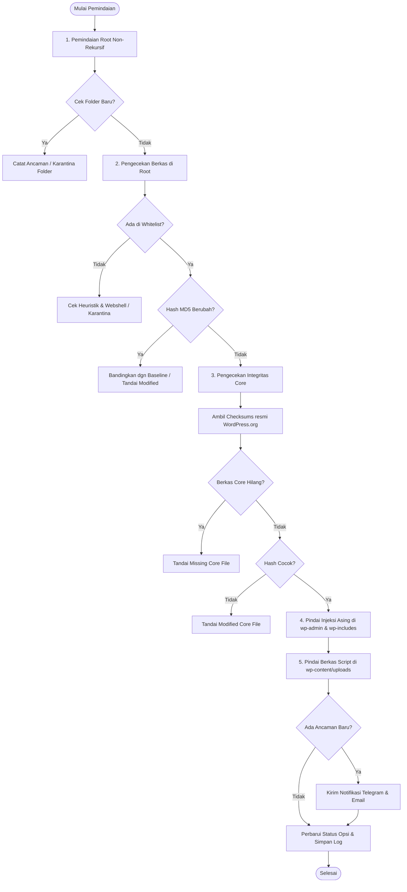

# Product Requirement Document (PRD)
# WP Root Guard

## 1. Ringkasan Eksekutif (Executive Summary)

**WP Root Guard** adalah plugin keamanan WordPress profesional dan berdaya guna tinggi (*lightweight & high-performance security guard*) yang dirancang khusus untuk memproteksi direktori krusial instalasi WordPress:
1. **Root Directory (`ABSPATH` / `public_html`)**
2. **Core System Directories (`wp-admin/` & `wp-includes/`)**
3. **Media & Uploads Directory (`wp-content/uploads/`)**

Fokus utamanya adalah pencegahan dan deteksi dini penyusupan berkas asing (*unauthorized file injection*), webshell/backdoor PHP, modifikasi berkas inti sistem (sering dimanfaatkan untuk infeksi malware judi online/slot), serta menyediakan fitur pemulihan mandiri (*self-healing*) secara otomatis dari server resmi WordPress.org.

---

## 2. Masalah & Latar Belakang (Problem Statement)

Banyak website WordPress berbasis shared hosting atau VPS sering mengalami:
- **Injeksi Folder/File Asing di Root**: Bot penyerang menaruh folder acak berisi ratusan berkas doorway/landing page judi slot di root direktori.
- **Injeksi Berkas PHP di Media/Uploads**: Hacker mengunggah webshell terselubung via celah tema/plugin ke `wp-content/uploads/`.
- **Modifikasi Berkas Core WordPress**: File sensitif seperti `index.php`, `wp-blog-header.php`, `wp-settings.php`, atau berkas di `wp-includes/` disusupi fungsi berbahaya (`eval`, `base64_decode`, backdoor hook).
- **Pengalihan Paksa (Forced Redirect) via `.htaccess` & `wp-config.php`**: Perubahan baris konfigurasi web server lokal untuk mengalihkan pengunjung organik mesin pencari ke situs judi eksternal.
- **Kurangnya Mekanisme Pemulihan Otomatis**: Administrator kesulitan mengidentifikasi baris kode mana yang diubah serta memakan waktu lama saat harus mengunduh dan menimpa berkas core secara manual.
- **Beban Server Berlebih dari Plugin Keamanan Konvensional**: Plugin keamanan gemuk sering membebani CPU & I/O server dengan pemindaian menyeluruh yang tidak efisien pada ribuan file tema/plugin pihak ketiga.

---

## 3. Tujuan Produk & Sasaran (Goals & Objectives)

1. **Kecepatan & Ringan (*High Performance & Low Resource*)**:
   - Pemindaian root non-rekursif tingkat pertama yang cepat tanpa membebani server.
   - Pengecekan core berdasar API Checksums resmi WordPress.org dengan caching transien.
   - Pemindaian media uploads yang terisolasi dan non-blocking.
2. **Presisi Tinggi & Rendah False-Positive**:
   - Mekanisme normalisasi CRLF vs LF untuk mencegah deteksi palsu akibat perbedaan format baris teks.
   - Baseline sistem lokal dipadukan dengan whitelist default dan kustom administrator.
3. **Penyelesaian Cepat (*Rapid Remediation*)**:
   - **Diff Viewer**: Inspeksi visual perbedaan baris per baris antara file lokal dan file resmi.
   - **Self-Healing Core**: 1-klik restore berkas core asli langsung dari SVN resmi WordPress.org.
   - **Local Baseline Rollback**: Pemulihan instan konfigurasi krusial (`.htaccess`, `wp-config.php`) dari snapshot terenkripsi.
   - **Auto-Quarantine Vault**: Isolasi aman berkas berbahaya ke folder terkunci `.htaccess`.
4. **Respon Cepat (*Incident Alerting*) & Blocker Cerdas**:
   - Notifikasi seketika via Telegram Bot API dan Email Administrator saat ditemukan ancaman baru.
   - Pencegahan IP penyerang dengan sistem Auto-Expire dan Whitelist IP Admin agar tidak terjadi *accidental lockout*.
5. **Akses Fleksibel (Sysadmin & DevOps Ready)**:
   - Dukungan antarmuka baris perintah (WP-CLI) untuk inspeksi dan pemulihan darurat tanpa GUI.

---

## 4. Pengguna Sasaran (Target Audience / Persona)

- **WordPress Administrator / Webmaster**: Membutuhkan sistem monitoring berkala yang tidak mengganggu kecepatan website.
- **DevOps & IT Security / PuTI (Pusat Teknologi Informasi)**: Memerlukan audit integritas berkas core, ekspor sampel forensik aman, dan transparansi hash berkas.
- **System Administrator / Server Engineer**: Membutuhkan kontrol pemindaian dan perbaikan instan via terminal SSH (WP-CLI).
- **Pemilik Bisnis / Website Institusi**: Membutuhkan proteksi situs dari defacement judi online dan malware SEO poisoning.

---

## 5. Arsitektur & Struktur Komponen

### 5.1 Struktur Direktori Proyek
```text
wp-root-guard-plugins/
├── wp-root-guard.php          # Entry point utama, autoloader, activation/deactivation hook
├── uninstall.php              # Pembersihan menyeluruh (options, cron, htaccess rules, baseline)
├── README.md                  # Dokumentasi publik & changelog
├── readme.txt                 # Dokumentasi standar repositori WordPress
├── PRD.md                     # Dokumen persyaratan produk & arsitektur teknis
├── admin/
│   ├── class-admin.php        # Controller admin, handler AJAX, dan dispatching aksi
│   ├── class-dashboard.php    # Widget ringkasan status di Dashboard utama WordPress (index.php)
│   ├── css/
│   │   └── wp-root-guard-admin.css # Styling UI, badging, floating action bar, diff modal
│   ├── js/
│   │   └── wp-root-guard-admin.js  # Frontend controller, AJAX scanner runner, code inspector modal
│   └── views/                 # Modularisasi template view admin
│       ├── tab-dashboard.php
│       ├── tab-settings.php
│       ├── modal-diff.php
│       └── modal-inspector.php
└── includes/
    ├── class-activator.php    # Lifecycle saat plugin diaktifkan (jadwal cron & inisialisasi baseline)
    ├── class-deactivator.php  # Lifecycle saat plugin dinonaktifkan (lepas jadwal cron)
    ├── class-plugin.php       # Orkestrasi lifecycle hook & inisialisasi class
    ├── class-scanner.php      # Engine pemindaian, deteksi webshell, self-healing, karantina
    ├── class-baseline.php     # Pembuat & pembaca baseline.json serta local snapshots
    ├── class-blocker.php      # HTTP request interceptor & IP blocking (.htaccess / PHP fallback)
    ├── class-cron.php         # Penjadwal interval otomatis WP-Cron
    ├── class-logger.php       # Pencatatan riwayat event audit ke database (maks 100 entri)
    ├── class-settings.php     # Konfigurasi opsi plugin dan manajemen whitelist
    ├── class-updater.php      # Auto-update integrasi langsung dengan GitHub Releases API
    └── class-cli.php          # Integrasi perintah WP-CLI (Command Line Interface)
```

### 5.2 Alur Pemindaian (Scan Flow Diagram)


---

## 6. Rincian Fitur & Fungsionalitas (Feature Specifications)

### 6.1 Core File Integrity Scanner & Checksums API
- **Endpoint API**: `https://api.wordpress.org/core/checksums/1.0/?version={wp_version}&locale={locale}`
- **Caching**: Disimpan di Transients API (`wp_root_guard_core_checksums`) selama 24 jam.
- **Kategori Temuan**:
  - `Missing Core File`: Berkas resmi hilang.
  - `Modified Core File`: Berkas resmi berubah (dengan toleransi `wp-config.php` dan normalisasi baris `\r\n` ke `\n`).
  - `Suspicious Core Injection`: Berkas tidak resmi yang ditanam di `wp-admin/` atau `wp-includes/`.

### 6.2 Self-Healing & Visual Diff Viewer
- **SVN Upstream**: `https://core.svn.wordpress.org/tags/{wp_version}/{relative_path}`
- **Proteksi Path Traversal**: Validasi ketat allowlist prefix dan `realpath()`.
- **Side-by-Side Diff**: Membandingkan berkas lokal vs SVN resmi secara visual dengan batasan maksimal 300 baris perubahan.
- **Perbaikan 1-Klik**: Opsi pemulihan per-berkas atau *Bulk Core Auto-Repair* melalui sticky floating bulk action bar.

### 6.3 Secure Code Inspector & Advanced Heuristic Engine
- Fitur modal read-only untuk menginspeksi isi file mencurigakan.
- **Deteksi Pattern Berbahaya Statis**:
  - Eksekusi kode dinamis: `eval()`, `create_function()`, `assert()`.
  - Eksekusi sistem / Shell: `system()`, `exec()`, `shell_exec()`, `passthru()`, `popen()`, `proc_open()`, `pcntl_exec()`.
  - Enkripsi/Obfuskasi: `base64_decode()`, `gzinflate()`, `gzuncompress()`, `str_rot13()`, `convert_uudecode()`.
  - Webshell signature populer: `c99shell`, `r57shell`, `b374k`, `wso_version`, `marvins`, `alfa_data`.
  - Dynamic Post/Get execution.
- **Deteksi Heuristik & Obfuskasi Dinamis (Baru)**:
  - *Dynamic String Concatenation*: Mendeteksi panggilan bertopeng seperti `('e'.'v'.'a'.'l')` atau `\x65\x76\x61\x6c`.
  - *Entropy Score Analysis*: Menghitung rasio keacakan karakter (Shannon Entropy). File dengan entropi tinggi (> 5.8) ditandai sebagai potensi payload terenkripsi/terobfuskasi.
  - *Double Extension Detection*: Memeriksa pola file tipuan seperti `.php.jpg`, `.phtml`, atau `.php5`.

### 6.4 Dedicated Quarantine Vault & Forensic Export
- **Lokasi Vault**: `wp-content/uploads/wp-root-guard-quarantine/`
- **Isolasi Keamanan**:
  - Berkas `.htaccess` internal dengan aturan proteksi ketat (`Require all denied` / `Deny from all`).
  - Berkas pelindung `index.html` tersembunyi.
- Aksi Karantina:
  - Prefix nama berkas/folder unik (`__quarantine_{timestamp}_{name}`).
  - Pengecualian otomatis folder karantina pada pemindaian folder uploads berikutnya agar tidak berulang terdeteksi.
- **Unduh Sampel Forensik Terenkripsi (Baru)**:
  - Opsi unduh berkas karantina dalam arsip ZIP yang diproteksi password standar industri malware (`infected`), aman dari pemblokiran antivirus lokal saat dianalisis oleh analis keamanan.

### 6.5 Local Snapshot & Rollback (`.htaccess` & `wp-config.php`) (Baru)
- Menyimpan salinan *golden baseline* terenkripsi untuk berkas `.htaccess` dan `wp-config.php` di direktori aman `uploads/wp-root-guard/snapshots/`.
- Menyediakan tombol pemulihan instan (Rollback) ketika berkas konfigurasi lokal disusupi aturan redirect judi slot tanpa mengganggu konfigurasi koneksi database.

### 6.6 Blocker & Smart IP Protection (.htaccess & PHP Fallback)
- Mencegat request yang mencoba mengakses/mengeksekusi ekstensi `.php`, `.phtml`, `.phar`, dll di direktori `wp-content/uploads/`.
- Mencegat query string mencurigakan (`?cmd=`, `?shell=`, `?eval(`, dll).
- Otomatis memasukkan IP penyerang ke blok aturan di `.htaccess` serta daftar IP terblokir di tingkat PHP (fallback untuk NGINX/IIS).
- Halaman respon 403 kustom dengan informasi detail dan pengecualian penuh untuk user Administrator (`manage_options`).
- **Admin IP Whitelist & Auto-Expire (Baru)**:
  - Fasilitas pendaftaran IP tetap Administrator (termasuk tombol 1-klik *"Whitelist IP Saya"*).
  - Pilihan durasi pemblokiran IP (1 Jam, 24 Jam, 7 Hari, atau Permanen) dengan cron pembersih otomatis untuk mencegah berkas `.htaccess` membengkak.

### 6.7 Notifikasi Multi-Channel & Webhook Fleksibel
- **Telegram Bot API**: Notifikasi instan dengan detail waktu WIB, jenis ancaman, path berkas, dan status. Murni read-only notification demi keamanan maksimal dengan verifikasi TLS/SSL (`sslverify => true`).
- **Email Administrator**: Notifikasi terintegrasi ke `admin_email` WordPress via `wp_mail()`.
- **Anti-Spam Alerting**: Notifikasi hanya dikirim jika ada identitas ancaman baru yang belum tersimpan di riwayat notifikasi (`wp_root_guard_notified_threats`).
- **Custom Webhook / Discord / Slack (Baru)**: Pengiriman payload JSON insiden ke URL webhook eksternal untuk integrasi dengan SIEM atau channel komunikasi tim pengembang.

### 6.8 Logging, Forensik & Ekspor CSV
- Log aktivitas tersimpan di database (Options API) dengan limit rolling 100 entri.
- Waktu standar WIB (Asia/Jakarta UTC+7) berformat Bahasa Indonesia.
- **Ekspor CSV**: Mengunduh seluruh log ke file `.csv` dengan UTF-8 BOM untuk kompatibilitas Microsoft Excel.
- **Paginasi Dinamis**: Lazy load 20 entri per batch.

### 6.9 Dukungan Antarmuka WP-CLI (Baru)
- Menjalankan operasi keamanan darurat langsung dari terminal server:
  - `wp root-guard scan` : Memulai pemindaian manual.
  - `wp root-guard report` : Menampilkan tabel ASCII ringkasan ancaman.
  - `wp root-guard fix --all` : Memulihkan seluruh berkas core yang rusak via SVN.
  - `wp root-guard unblock <ip>` : Membuka blokir IP jika admin terkunci.

### 6.10 Auto-Updater via GitHub
- Terhubung langsung ke API Releases GitHub (`halimurrosyid/wp-root-guard-plugins`).
- Transients caching selama 12 jam.
- Mendukung pembaruan native 1-klik melalui dasbor `update-core.php` dan `plugins.php` WordPress.

---

## 7. Kebutuhan Non-Fungsional (Non-Functional Requirements)

1. **Kompatibilitas Sistem**:
   - PHP: Minimal PHP 8.1+ (disertai type safety dan pengecekan sintaks modern).
   - WordPress: Minimal WordPress 6.0+.
   - Web Server: Apache, NGINX, Litespeed, IIS.
2. **Kinerja & Skalabilitas**:
   - Rate limiting pemindaian manual via AJAX: 1 kali per 20 detik per user.
   - Diff viewer dibatasi hingga 300 baris untuk mencegah memory exhaustion.
   - Pengecekan ukuran berkas maksimal 1 MB sebelum pemindaian konten webshell.
   - Chunked/Batch processing pada pemindaian rekursif direktori `uploads/`.
3. **Keamanan (Security by Design)**:
   - Verifikasi Nonce (`wp_verify_nonce`) pada setiap aksi admin, AJAX, dan bulk actions.
   - Pengecekan kapabilitas hak akses `manage_options` pada seluruh endpoint.
   - Pencegahan menyeluruh terhadap celah Path Traversal (`realpath()`, regex validation, directory traversal sanitization).
   - Sanitasi input dan escaping output ketat (`esc_html`, `esc_attr`, `esc_url`).
   - Tidak ada hardcoded credentials (token bot atau password) di dalam repositori publik.
   - Verifikasi SSL/TLS aktif (`sslverify => true`) pada semua koneksi outbound HTTP.

---

## 8. Rencana Pengembangan & Peluang Peningkatan (Roadmap & Backlog)

| Fase / Prioritas | Inisiatif Fitur / Penyempurnaan | Kategori | Kompleksitas |
| :---: | :--- | :---: | :---: |
| **Fase 1 (Segera)** | **Security Hotfix**: Hapus default hardcoded token Telegram & aktifkan SSL verification | Keamanan | Rendah |
| **Fase 1 (Segera)** | **Reverse Proxy IP Fix**: Sanitasi dan validasi remote IP di `Blocker::get_client_ip()` | Keamanan | Rendah |
| **Fase 2 (Arsitektur)** | **Modularisasi Admin**: Pisahkan `class-admin.php` ke folder `admin/views/` dan file JS terpisah | Refaktorisasi | Sedang |
| **Fase 2 (Arsitektur)** | **I18n Completion**: Pembungkusan menyeluruh teks bahasa ke format gettext standar | Kualitas Kode | Sedang |
| **Fase 3 (Fitur Utama)** | **Local Snapshot & Restore**: Fitur rollback `.htaccess` & `wp-config.php` ke baseline aman | Fitur Baru | Sedang |
| **Fase 3 (Fitur Utama)** | **Admin IP Whitelist & Auto-Expire Blocker**: Durasi blokir dinamis & whitelist admin | Fitur Baru | Sedang |
| **Fase 4 (Lanjutan)** | **WP-CLI Command Integration**: Dukungan command line interface lengkap | Fitur Baru | Sedang |
| **Fase 4 (Lanjutan)** | **Advanced Heuristic Scanner**: Deteksi concatenation, entropi tinggi, dan hex obfuskasi | Fitur Baru | Tinggi |
| **Fase 4 (Lanjutan)** | **Forensic Sample Download**: Ekspor ZIP ber-password untuk berkas karantina | Fitur Baru | Rendah |

---

## 9. Metrik Keberhasilan (Success Metrics)

1. **Resource Footprint**: Rata-rata waktu eksekusi scan di bawah 1.5 detik pada instalasi root standar.
2. **False Positive Rate**: 0 laporan false positive pada berkas core resmi WordPress yang bersih.
3. **Recovery Time**: Pemulihan berkas core termodifikasi dapat dilakukan dalam < 3 detik via tombol Restore.
4. **Zero Vulnerability**: Lolos 100% audit keamanan (XSS, CSRF, Path Traversal, IP Spoofing, RCE).
5. **Code Maintainability**: Ukuran file modul admin tidak melebihi 400 baris per file dengan pemisahan View dan Controller yang bersih.
