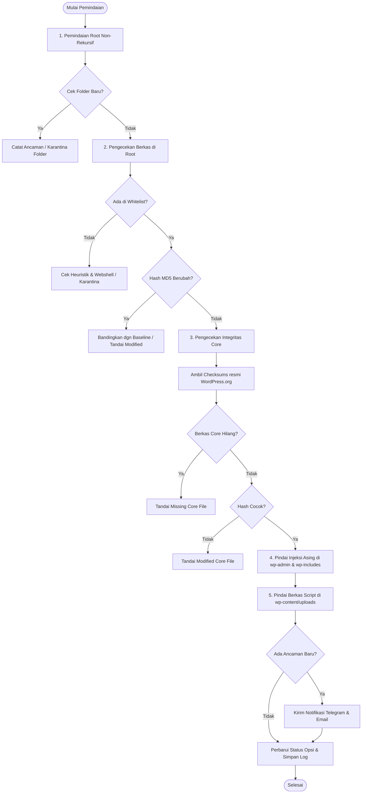

# Product Requirement Document (PRD)
# WP Root Guard

## 1. Ringkasan Eksekutif (Executive Summary)

**WP Root Guard** adalah plugin keamanan WordPress profesional dan berdaya guna tinggi (*lightweight & high-performance security guard*) yang dirancang khusus untuk memproteksi direktori krusial instalasi WordPress:
1. **Root Directory (`ABSPATH` / `public_html`)**
2. **Core System Directories (`wp-admin/` & `wp-includes/`)**
3. **Media & Uploads Directory (`wp-content/uploads/`)**

Fokus utamanya adalah pencegahan dan deteksi dini penyusupan berkas asing (*unauthorized file injection*), webshell/backdoor PHP, modifikasi berkas inti sistem (sering dimanfaatkan untuk infeksi malware judi online/slot), serta menyediakan fitur pemulihan mandiri (*self-healing*) secara otomatis dari server resmi WordPress.org.

---

## 2. Masalah & Latar Belakang (Problem Statement)

Banyak website WordPress berbasis shared hosting atau VPS sering mengalami:
- **Injeksi Folder/File Asing di Root**: Bot penyerang menaruh folder acak berisi ratusan berkas doorway/landing page judi slot di root direktori.
- **Injeksi Berkas PHP di Media/Uploads**: Hacker mengunggah webshell terselubung via celah tema/plugin ke `wp-content/uploads/`.
- **Modifikasi Berkas Core WordPress**: File sensitif seperti `index.php`, `wp-blog-header.php`, `wp-settings.php`, atau berkas di `wp-includes/` disusupi fungsi berbahaya (`eval`, `base64_decode`, backdoor hook).
- **Pengalihan Paksa (Forced Redirect) via `.htaccess` & `wp-config.php`**: Perubahan baris konfigurasi web server lokal untuk mengalihkan pengunjung organik mesin pencari ke situs judi eksternal.
- **Kurangnya Mekanisme Pemulihan Otomatis**: Administrator kesulitan mengidentifikasi baris kode mana yang diubah serta memakan waktu lama saat harus mengunduh dan menimpa berkas core secara manual.
- **Beban Server Berlebih dari Plugin Keamanan Konvensional**: Plugin keamanan gemuk sering membebani CPU & I/O server dengan pemindaian menyeluruh yang tidak efisien pada ribuan file tema/plugin pihak ketiga.

---

## 3. Tujuan Produk & Sasaran (Goals & Objectives)

1. **Kecepatan & Ringan (*High Performance & Low Resource*)**:
   - Pemindaian root non-rekursif tingkat pertama yang cepat tanpa membebani server.
   - Pengecekan core berdasar API Checksums resmi WordPress.org dengan caching transien.
   - Pemindaian media uploads yang terisolasi dan non-blocking.
2. **Presisi Tinggi & Rendah False-Positive**:
   - Mekanisme normalisasi CRLF vs LF untuk mencegah deteksi palsu akibat perbedaan format baris teks.
   - Baseline sistem lokal dipadukan dengan whitelist default dan kustom administrator.
3. **Penyelesaian Cepat (*Rapid Remediation*)**:
   - **Diff Viewer**: Inspeksi visual perbedaan baris per baris antara file lokal dan file resmi.
   - **Self-Healing Core**: 1-klik restore berkas core asli langsung dari SVN resmi WordPress.org.
   - **Local Baseline Rollback**: Pemulihan instan konfigurasi krusial (`.htaccess`, `wp-config.php`) dari snapshot terenkripsi.
   - **Auto-Quarantine Vault**: Isolasi aman berkas berbahaya ke folder terkunci `.htaccess`.
4. **Respon Cepat (*Incident Alerting*) & Blocker Cerdas**:
   - Notifikasi seketika via Telegram Bot API dan Email Administrator saat ditemukan ancaman baru.
   - Pencegahan IP penyerang dengan sistem Auto-Expire dan Whitelist IP Admin agar tidak terjadi *accidental lockout*.
5. **Akses Fleksibel (Sysadmin & DevOps Ready)**:
   - Dukungan antarmuka baris perintah (WP-CLI) untuk inspeksi dan pemulihan darurat tanpa GUI.

---

## 4. Pengguna Sasaran (Target Audience / Persona)

- **WordPress Administrator / Webmaster**: Membutuhkan sistem monitoring berkala yang tidak mengganggu kecepatan website.
- **DevOps & IT Security / PuTI (Pusat Teknologi Informasi)**: Memerlukan audit integritas berkas core, ekspor sampel forensik aman, dan transparansi hash berkas.
- **System Administrator / Server Engineer**: Membutuhkan kontrol pemindaian dan perbaikan instan via terminal SSH (WP-CLI).
- **Pemilik Bisnis / Website Institusi**: Membutuhkan proteksi situs dari defacement judi online dan malware SEO poisoning.

---

## 5. Arsitektur & Struktur Komponen

### 5.1 Struktur Direktori Proyek
```text
wp-root-guard-plugins/
├── wp-root-guard.php          # Entry point utama, autoloader, activation/deactivation hook
├── uninstall.php              # Pembersihan menyeluruh (options, cron, htaccess rules, baseline)
├── README.md                  # Dokumentasi publik & changelog
├── readme.txt                 # Dokumentasi standar repositori WordPress
├── PRD.md                     # Dokumen persyaratan produk & arsitektur teknis
├── admin/
│   ├── class-admin.php        # Controller admin, handler AJAX, dan dispatching aksi
│   ├── class-dashboard.php    # Widget ringkasan status di Dashboard utama WordPress (index.php)
│   ├── css/
│   │   └── wp-root-guard-admin.css # Styling UI, badging, floating action bar, diff modal
│   ├── js/
│   │   └── wp-root-guard-admin.js  # Frontend controller, AJAX scanner runner, code inspector modal
│   └── views/                 # Modularisasi template view admin
│       ├── tab-dashboard.php
│       ├── tab-settings.php
│       ├── modal-diff.php
│       └── modal-inspector.php
└── includes/
    ├── class-activator.php    # Lifecycle saat plugin diaktifkan (jadwal cron & inisialisasi baseline)
    ├── class-deactivator.php  # Lifecycle saat plugin dinonaktifkan (lepas jadwal cron)
    ├── class-plugin.php       # Orkestrasi lifecycle hook & inisialisasi class
    ├── class-scanner.php      # Engine pemindaian, deteksi webshell, self-healing, karantina
    ├── class-baseline.php     # Pembuat & pembaca baseline.json serta local snapshots
    ├── class-blocker.php      # HTTP request interceptor & IP blocking (.htaccess / PHP fallback)
    ├── class-cron.php         # Penjadwal interval otomatis WP-Cron
    ├── class-logger.php       # Pencatatan riwayat event audit ke database (maks 100 entri)
    ├── class-settings.php     # Konfigurasi opsi plugin dan manajemen whitelist
    ├── class-updater.php      # Auto-update integrasi langsung dengan GitHub Releases API
    └── class-cli.php          # Integrasi perintah WP-CLI (Command Line Interface)
```

### 5.2 Alur Pemindaian (Scan Flow Diagram)

```mermaid
flowchart TD
    Start([Mulai Pemindaian]) --> A[1. Pemindaian Root Non-Rekursif]
    A --> A1{Cek Folder Baru?}
    A1 -- Ya --> A2[Catat Ancaman / Karantina Folder]
    A1 -- Tidak --> B[2. Pengecekan Berkas di Root]

    B --> B1{Ada di Whitelist?}
    B1 -- Tidak --> B2[Cek Heuristik & Webshell / Karantina]
    B1 -- Ya --> B3{Hash MD5 Berubah?}
    B3 -- Ya --> B4[Bandingkan dgn Baseline / Tandai Modified]
    B3 -- Tidak --> C[3. Pengecekan Integritas Core]

    C --> C1[Ambil Checksums resmi WordPress.org]
    C1 --> C2{Berkas Core Hilang?}
    C2 -- Ya --> C3[Tandai Missing Core File]
    C2 -- Tidak --> C4{Hash Cocok?}
    C4 -- Tidak --> C5[Tandai Modified Core File]
    C4 -- Ya --> D[4. Pindai Injeksi Asing di wp-admin & wp-includes]

    D --> E[5. Pindai Berkas Script di wp-content/uploads]
    E --> F{Ada Ancaman Baru?}
    F -- Ya --> G[Kirim Notifikasi Telegram & Email]
    F -- Tidak --> H[Perbarui Status Opsi & Simpan Log]
    G --> H
    H --> Selesai([Selesai])
```

---

## 6. Rincian Fitur & Fungsionalitas (Feature Specifications)

### 6.1 Core File Integrity Scanner & Checksums API
- **Endpoint API**: `https://api.wordpress.org/core/checksums/1.0/?version={wp_version}&locale={locale}`
- **Caching**: Disimpan di Transients API (`wp_root_guard_core_checksums`) selama 24 jam.
- **Kategori Temuan**:
  - `Missing Core File`: Berkas resmi hilang.
  - `Modified Core File`: Berkas resmi berubah (dengan toleransi `wp-config.php` dan normalisasi baris `\r\n` ke `\n`).
  - `Suspicious Core Injection`: Berkas tidak resmi yang ditanam di `wp-admin/` atau `wp-includes/`.

### 6.2 Self-Healing & Visual Diff Viewer
- **SVN Upstream**: `https://core.svn.wordpress.org/tags/{wp_version}/{relative_path}`
- **Proteksi Path Traversal**: Validasi ketat allowlist prefix dan `realpath()`.
- **Side-by-Side Diff**: Membandingkan berkas lokal vs SVN resmi secara visual dengan batasan maksimal 300 baris perubahan.
- **Perbaikan 1-Klik**: Opsi pemulihan per-berkas atau *Bulk Core Auto-Repair* melalui sticky floating bulk action bar.

### 6.3 Secure Code Inspector & Advanced Heuristic Engine
- Fitur modal read-only untuk menginspeksi isi file mencurigakan.
- **Deteksi Pattern Berbahaya Statis**:
  - Eksekusi kode dinamis: `eval()`, `create_function()`, `assert()`.
  - Eksekusi sistem / Shell: `system()`, `exec()`, `shell_exec()`, `passthru()`, `popen()`, `proc_open()`, `pcntl_exec()`.
  - Enkripsi/Obfuskasi: `base64_decode()`, `gzinflate()`, `gzuncompress()`, `str_rot13()`, `convert_uudecode()`.
  - Webshell signature populer: `c99shell`, `r57shell`, `b374k`, `wso_version`, `marvins`, `alfa_data`.
  - Dynamic Post/Get execution.
- **Deteksi Heuristik & Obfuskasi Dinamis (Baru)**:
  - *Dynamic String Concatenation*: Mendeteksi panggilan bertopeng seperti `('e'.'v'.'a'.'l')` atau `\x65\x76\x61\x6c`.
  - *Entropy Score Analysis*: Menghitung rasio keacakan karakter (Shannon Entropy). File dengan entropi tinggi (> 5.8) ditandai sebagai potensi payload terenkripsi/terobfuskasi.
  - *Double Extension Detection*: Memeriksa pola file tipuan seperti `.php.jpg`, `.phtml`, atau `.php5`.

### 6.4 Dedicated Quarantine Vault & Forensic Export
- **Lokasi Vault**: `wp-content/uploads/wp-root-guard-quarantine/`
- **Isolasi Keamanan**:
  - Berkas `.htaccess` internal dengan aturan proteksi ketat (`Require all denied` / `Deny from all`).
  - Berkas pelindung `index.html` tersembunyi.
- Aksi Karantina:
  - Prefix nama berkas/folder unik (`__quarantine_{timestamp}_{name}`).
  - Pengecualian otomatis folder karantina pada pemindaian folder uploads berikutnya agar tidak berulang terdeteksi.
- **Unduh Sampel Forensik Terenkripsi (Baru)**:
  - Opsi unduh berkas karantina dalam arsip ZIP yang diproteksi password standar industri malware (`infected`), aman dari pemblokiran antivirus lokal saat dianalisis oleh analis keamanan.

### 6.5 Local Snapshot & Rollback (`.htaccess` & `wp-config.php`) (Baru)
- Menyimpan salinan *golden baseline* terenkripsi untuk berkas `.htaccess` dan `wp-config.php` di direktori aman `uploads/wp-root-guard/snapshots/`.
- Menyediakan tombol pemulihan instan (Rollback) ketika berkas konfigurasi lokal disusupi aturan redirect judi slot tanpa mengganggu konfigurasi koneksi database.

### 6.6 Blocker & Smart IP Protection (.htaccess & PHP Fallback)
- Mencegat request yang mencoba mengakses/mengeksekusi ekstensi `.php`, `.phtml`, `.phar`, dll di direktori `wp-content/uploads/`.
- Mencegat query string mencurigakan (`?cmd=`, `?shell=`, `?eval(`, dll).
- Otomatis memasukkan IP penyerang ke blok aturan di `.htaccess` serta daftar IP terblokir di tingkat PHP (fallback untuk NGINX/IIS).
- Halaman respon 403 kustom dengan informasi detail dan pengecualian penuh untuk user Administrator (`manage_options`).
- **Admin IP Whitelist & Auto-Expire (Baru)**:
  - Fasilitas pendaftaran IP tetap Administrator (termasuk tombol 1-klik *"Whitelist IP Saya"*).
  - Pilihan durasi pemblokiran IP (1 Jam, 24 Jam, 7 Hari, atau Permanen) dengan cron pembersih otomatis untuk mencegah berkas `.htaccess` membengkak.

### 6.7 Notifikasi Multi-Channel & Webhook Fleksibel
- **Telegram Bot API**: Notifikasi instan dengan detail waktu WIB, jenis ancaman, path berkas, dan status. Murni read-only notification demi keamanan maksimal dengan verifikasi TLS/SSL (`sslverify => true`).
- **Email Administrator**: Notifikasi terintegrasi ke `admin_email` WordPress via `wp_mail()`.
- **Anti-Spam Alerting**: Notifikasi hanya dikirim jika ada identitas ancaman baru yang belum tersimpan di riwayat notifikasi (`wp_root_guard_notified_threats`).
- **Custom Webhook / Discord / Slack (Baru)**: Pengiriman payload JSON insiden ke URL webhook eksternal untuk integrasi dengan SIEM atau channel komunikasi tim pengembang.

### 6.8 Logging, Forensik & Ekspor CSV
- Log aktivitas tersimpan di database (Options API) dengan limit rolling 100 entri.
- Waktu standar WIB (Asia/Jakarta UTC+7) berformat Bahasa Indonesia.
- **Ekspor CSV**: Mengunduh seluruh log ke file `.csv` dengan UTF-8 BOM untuk kompatibilitas Microsoft Excel.
- **Paginasi Dinamis**: Lazy load 20 entri per batch.

### 6.9 Dukungan Antarmuka WP-CLI (Baru)
- Menjalankan operasi keamanan darurat langsung dari terminal server:
  - `wp root-guard scan` : Memulai pemindaian manual.
  - `wp root-guard report` : Menampilkan tabel ASCII ringkasan ancaman.
  - `wp root-guard fix --all` : Memulihkan seluruh berkas core yang rusak via SVN.
  - `wp root-guard unblock <ip>` : Membuka blokir IP jika admin terkunci.

### 6.10 Auto-Updater via GitHub
- Terhubung langsung ke API Releases GitHub (`halimurrosyid/wp-root-guard-plugins`).
- Transients caching selama 12 jam.
- Mendukung pembaruan native 1-klik melalui dasbor `update-core.php` dan `plugins.php` WordPress.

---

## 7. Kebutuhan Non-Fungsional (Non-Functional Requirements)

1. **Kompatibilitas Sistem**:
   - PHP: Minimal PHP 8.1+ (disertai type safety dan pengecekan sintaks modern).
   - WordPress: Minimal WordPress 6.0+.
   - Web Server: Apache, NGINX, Litespeed, IIS.
2. **Kinerja & Skalabilitas**:
   - Rate limiting pemindaian manual via AJAX: 1 kali per 20 detik per user.
   - Diff viewer dibatasi hingga 300 baris untuk mencegah memory exhaustion.
   - Pengecekan ukuran berkas maksimal 1 MB sebelum pemindaian konten webshell.
   - Chunked/Batch processing pada pemindaian rekursif direktori `uploads/`.
3. **Keamanan (Security by Design)**:
   - Verifikasi Nonce (`wp_verify_nonce`) pada setiap aksi admin, AJAX, dan bulk actions.
   - Pengecekan kapabilitas hak akses `manage_options` pada seluruh endpoint.
   - Pencegahan menyeluruh terhadap celah Path Traversal (`realpath()`, regex validation, directory traversal sanitization).
   - Sanitasi input dan escaping output ketat (`esc_html`, `esc_attr`, `esc_url`).
   - Tidak ada hardcoded credentials (token bot atau password) di dalam repositori publik.
   - Verifikasi SSL/TLS aktif (`sslverify => true`) pada semua koneksi outbound HTTP.

---

## 8. Rencana Pengembangan & Peluang Peningkatan (Roadmap & Backlog)

| Fase / Prioritas | Inisiatif Fitur / Penyempurnaan | Kategori | Kompleksitas |
| :---: | :--- | :---: | :---: |
| **Fase 1 (Segera)** | **Security Hotfix**: Hapus default hardcoded token Telegram & aktifkan SSL verification | Keamanan | Rendah |
| **Fase 1 (Segera)** | **Reverse Proxy IP Fix**: Sanitasi dan validasi remote IP di `Blocker::get_client_ip()` | Keamanan | Rendah |
| **Fase 2 (Arsitektur)** | **Modularisasi Admin**: Pisahkan `class-admin.php` ke folder `admin/views/` dan file JS terpisah | Refaktorisasi | Sedang |
| **Fase 2 (Arsitektur)** | **I18n Completion**: Pembungkusan menyeluruh teks bahasa ke format gettext standar | Kualitas Kode | Sedang |
| **Fase 3 (Fitur Utama)** | **Local Snapshot & Restore**: Fitur rollback `.htaccess` & `wp-config.php` ke baseline aman | Fitur Baru | Sedang |
| **Fase 3 (Fitur Utama)** | **Admin IP Whitelist & Auto-Expire Blocker**: Durasi blokir dinamis & whitelist admin | Fitur Baru | Sedang |
| **Fase 4 (Lanjutan)** | **WP-CLI Command Integration**: Dukungan command line interface lengkap | Fitur Baru | Sedang |
| **Fase 4 (Lanjutan)** | **Advanced Heuristic Scanner**: Deteksi concatenation, entropi tinggi, dan hex obfuskasi | Fitur Baru | Tinggi |
| **Fase 4 (Lanjutan)** | **Forensic Sample Download**: Ekspor ZIP ber-password untuk berkas karantina | Fitur Baru | Rendah |

---

## 9. Metrik Keberhasilan (Success Metrics)

1. **Resource Footprint**: Rata-rata waktu eksekusi scan di bawah 1.5 detik pada instalasi root standar.
2. **False Positive Rate**: 0 laporan false positive pada berkas core resmi WordPress yang bersih.
3. **Recovery Time**: Pemulihan berkas core termodifikasi dapat dilakukan dalam < 3 detik via tombol Restore.
4. **Zero Vulnerability**: Lolos 100% audit keamanan (XSS, CSRF, Path Traversal, IP Spoofing, RCE).
5. **Code Maintainability**: Ukuran file modul admin tidak melebihi 400 baris per file dengan pemisahan View dan Controller yang bersih.

---

## 10. Audit Blindspot Fitur Existing (Static Review, 29 September 2026)

Bagian ini mencatat kondisi implementasi aktual yang perlu dibedakan dari requirement, roadmap, dan klaim produk. Temuan ini menjadi dasar prioritas hardening; bukan berarti seluruh fitur gagal bekerja, tetapi menunjukkan batas keamanan, operasional, dan cakupan deteksinya.

### 10.1 Matriks Blindspot per Fitur

| Fitur | Kondisi / Blindspot Aktual | Dampak | Kebutuhan Pengembangan |
|---|---|---|---|
| Lifecycle aktivasi | Aktivasi membuat baseline, menjadwalkan cron, lalu dapat menjalankan scan penuh pada request yang sama. | Aktivasi dapat lambat atau timeout pada situs besar. | Pindahkan initial scan ke background job dan tampilkan status inisialisasi. |
| WP-Cron otomatis | Cron bergantung pada traffic WordPress dan belum memiliki scan lock global. | Scan dapat terlambat pada situs sepi atau tumpang tindih dengan scan AJAX/cron lain. | Gunakan lock, missed-run monitor, resumable job, dan panduan system cron. |
| Root folder scan | Hanya memindai level pertama root. | Malware di dalam folder `wp-content`, plugin, theme, atau folder nested lain tidak tercakup oleh fitur ini. | Tambahkan scope scanner terpisah untuk area penting dan manifest integritas. |
| Root file baseline | Baseline awal mempercayai kondisi filesystem saat plugin dipasang; berkas lebih dari batas ukuran dapat diabaikan. | Situs yang sudah terinfeksi dapat menjadikan artefak malware sebagai baseline; file besar tidak terverifikasi. | Terapkan baseline approval, status `pending verification`, dan status khusus untuk file yang tidak dipindai. |
| Core Checksums API | Jika API checksum gagal atau circuit breaker aktif, core integrity scan dilewati; hasil scan tetap dapat menjadi `safe` bila tidak ada temuan lain. | False-safe: core yang tidak terverifikasi dapat dilaporkan aman. | Tambahkan status `degraded`/`failed`, detail komponen yang belum diverifikasi, retry terukur, dan alert kegagalan berulang. |
| Core injection detection | Traversal `wp-admin`/`wp-includes` penuh pada setiap scan dan mengandalkan daftar checksum yang tersedia. | Beban I/O meningkat; saat checksum unavailable, injection scan juga tidak berjalan. | Batch scan, cache manifest, scan cursor, dan status coverage. |
| Uploads PHP scanner | Mendeteksi ekstensi script secara rekursif, tetapi belum memeriksa MIME mismatch, `.user.ini`, SVG/JS/HTML berbahaya, polyglot, atau konfigurasi server. | Banyak teknik upload malware dan persistence dapat lolos. | Tambahkan MIME/content analysis, double extension, server config scan, dan risk scoring. |
| Webshell signature scanner | Hanya memindai ekstensi `php`, `htaccess`, `html`, dan `txt`, berukuran maksimal 1 MB, dengan signature statis. | Payload besar, terobfuskasi, atau berformat lain dapat tidak terdeteksi. | Tambahkan entropy, hex/`chr()`, concatenation, variable function, dynamic include, dan analisis berbasis skor. |
| Blocker request | Blocker berjalan pada hook WordPress `init`. File PHP di uploads yang dipanggil langsung dapat dieksekusi web server sebelum WordPress memuat plugin. Pattern request juga belum dinormalisasi penuh untuk encoding URL. | Proteksi tidak efektif terhadap direct execution dan beberapa variasi encoded payload. | Tambahkan deny-execution rule server-level untuk Apache/NGINX/IIS, canonicalization request, dan pengujian per web server. |
| IP blocker | IP expiry bergantung pada WP-Cron; aturan `.htaccess` dapat tertinggal bila cron tidak berjalan. Perubahan `.htaccess` belum mempunyai backup/rollback terintegrasi. | Risiko lockout, konfigurasi Apache terganggu, atau blokir kedaluwarsa tetap aktif. | Backup berversi, syntax/access validation, rollback, dan evaluasi expiry saat read path. |
| Self-healing core | Konten remote dari SVN/GitHub ditulis langsung tanpa pembandingan checksum resmi sebelum write; write belum atomic. | Berkas bisa tidak lengkap saat proses gagal dan integritas konten restore tidak diverifikasi secara independen. | Verifikasi checksum, temporary file, atomic rename, backup singkat, dan rollback. |
| Diff viewer | Diff dibatasi 300 perbedaan tetapi belum dibatasi dengan allowlist manifest core yang sama ketatnya dengan restore. | Analisis dapat tidak lengkap; path policy perlu disatukan. | Gunakan helper path tunggal dan tampilkan status diff terpotong/coverage. |
| Secure Code Inspector | Inspector dapat membaca file sampai 2 MB berdasarkan path di bawah root; validasi prefix path perlu boundary direktori yang ketat. | Berkas sensitif seperti konfigurasi dapat terekspos kepada role admin; ada risiko sibling-path bila prefix tidak dibatasi separator. | Canonical path helper, allowlist berdasarkan temuan, redaksi secret, dan audit akses inspector. |
| Quarantine vault | Vault berada di `wp-content/uploads`; proteksi `.htaccess` tidak berlaku untuk NGINX/IIS dan `rename()` dapat gagal jika filesystem berbeda. | File karantina dapat terekspos publik atau threat gagal dipindahkan tanpa remediation alternatif. | Simpan vault di luar webroot bila tersedia; deny rule tervalidasi; fallback copy-verify-delete; dry-run dan rollback. |
| Auto-quarantine | Tindakan dapat dilakukan berdasarkan deteksi ekstensi/signature yang belum memiliki confidence score. | False positive dapat memindahkan file legitimate dan mengganggu situs. | Tambahkan risk score, approval threshold, preview dry-run, dan restore teruji. |
| Notifikasi | Deduplikasi menggunakan identitas `type:name`; perubahan berulang pada file sama tidak selalu menghasilkan alert baru. Tidak ada retry queue atau delivery state. | Incident lanjutan dapat terlewat dan kegagalan provider sulit ditelusuri. | Gunakan fingerprint berbasis hash/status, retry terbatas, delivery audit, rate limit, dan redaksi path sensitif. |
| Logging | Log dibatasi 100 entri dalam Options API. | Bukti forensik cepat tergeser oleh scan berulang; kurang ideal untuk multisite/insiden besar. | Tabel audit khusus atau export terstruktur, retention policy, event ID, actor/IP/request ID. |
| Admin & AJAX | Rate limit hanya berlaku untuk scan AJAX per user; controller dan render masih monolitik. | Operasi berat tetap dapat bersaing dengan cron; kode sulit diuji dan dirawat. | Global scan lock, queue status, service/controller/view split, dan test endpoint. |
| Plugin/theme/MU-plugin | Tidak ada integrity scan untuk plugin, theme, atau MU-plugin; tidak ada audit database persistence. | Backdoor pada kode non-core, rogue admin, cron asing, option injection, redirect, atau SEO-spam dapat luput. | Manifest/checksum WordPress.org, baseline custom approval, audit user/cron/options/redirect/permission/ownership. |
| Updater GitHub | URL package dibatasi domain, tetapi artefak update belum diverifikasi dengan signature atau SHA-256 manifest. | Risiko supply-chain jika release/repository dikompromikan. | Signed release, checksum manifest, pinned metadata, dan opsi approval manual. |
| Anti-deactivate | Belum ada policy, detector, external alert, atau recovery workflow khusus deaktivasi. | Plugin dapat dinonaktifkan tanpa bukti/alert proaktif. | Protected deactivation policy, tamper-evident audit, break-glass recovery, dan optional MU-plugin guardian. |

### 10.2 Kesenjangan Requirement vs Implementasi

Requirement berikut masih merupakan target/roadmap dan **belum boleh diposisikan sebagai fitur aktif** sampai tersedia implementasi serta pengujian yang dapat dibuktikan:

- Chunked/batch processing uploads dan pemulihan scan setelah timeout.
- Local snapshot/rollback `.htaccess` dan `wp-config.php`.
- Forensic ZIP berpassword.
- Custom webhook Discord/Slack/SIEM.
- WP-CLI commands.
- Advanced heuristic scanner: entropy, concatenation, dan hex obfuscation.
- Admin views terpisah seperti `admin/views/` dan modularisasi penuh controller.

### 10.3 Requirement Hardening Baru

1. **Status Kepercayaan Scan**
   - Scan wajib mengembalikan status `safe`, `threat`, `degraded`, atau `failed`.
   - `safe` hanya boleh dipakai jika seluruh scope aktif selesai diverifikasi tanpa error kritis.

2. **Server-Level Execution Guard**
   - Plugin harus menyediakan rule yang memblokir eksekusi script dalam uploads dan vault pada Apache, NGINX, dan IIS.
   - Setelah rule diterapkan, plugin harus mencatat hasil validasi akses.

3. **Canonical Filesystem Guard**
   - Semua operasi read, diff, restore, quarantine, delete, dan restore-from-quarantine harus menggunakan helper canonical path yang sama.
   - Validasi containment harus memakai boundary direktori, bukan prefix string biasa.

4. **Verified Remediation**
   - Restore core hanya boleh menulis file setelah konten remote cocok dengan checksum resmi.
   - Write harus atomic dan memiliki backup/rollback terukur.

5. **Baseline Trust Separation**
   - Core update tidak boleh secara otomatis mempercayai ulang semua folder/berkas root.
   - Perubahan baseline root harus membutuhkan approval admin atau policy eksplisit.

6. **Coverage Transparan**
   - Dashboard harus menyatakan area yang dipindai, dilewati, gagal dipindai, dan tidak didukung.
   - File melebihi limit ukuran, permission denied, dan remote API failure wajib dilaporkan sebagai coverage gap.

7. **Safe Automation**
   - Auto-quarantine dan auto-block harus mendukung dry-run, evidence log, rollback, dan batas tindakan per eksekusi.

### 10.4 Prioritas Remediasi

| Prioritas | Target | Kriteria Hasil |
| :---: | :--- | :--- |
| **P0** | Status `degraded/failed`, scan lock, dan batch scan | Tidak ada false-safe atau scan bertumpuk tanpa terdeteksi. |
| **P0** | Uploads/vault server-level guard | Script atau artefak karantina tidak dapat diakses/eksekusi publik di Apache, NGINX, dan IIS. |
| **P0** | Canonical path guard dan inspector redaction | Tidak ada bypass containment atau pembacaan secret melalui inspector. |
| **P0** | Checksum-verified atomic restore | Restore tidak menulis konten tidak tervalidasi dan dapat dipulihkan jika gagal. |
| **P0** | Baseline root/core separation | Core update tidak melegitimasi perubahan root yang mencurigakan. |
| **P1** | Plugin/theme/MU-plugin dan persistence audit | Cakupan deteksi meliputi kode non-core serta persistence database utama. |
| **P1** | Quarantine/`.htaccess` rollback | Aksi otomatis dapat dipreview, dilacak, dan dibatalkan dengan aman. |
| **P1** | Signed updater dan notification delivery state | Risiko supply-chain dan alert failure berkurang. |
| **P2** | Advanced heuristic scanner dan forensic logging | Deteksi obfuscation serta investigasi insiden lebih kuat. |
| **P2** | Refactor admin/scanner dan automated tests | Kode dapat diuji, dirawat, dan diregresi secara konsisten. |
